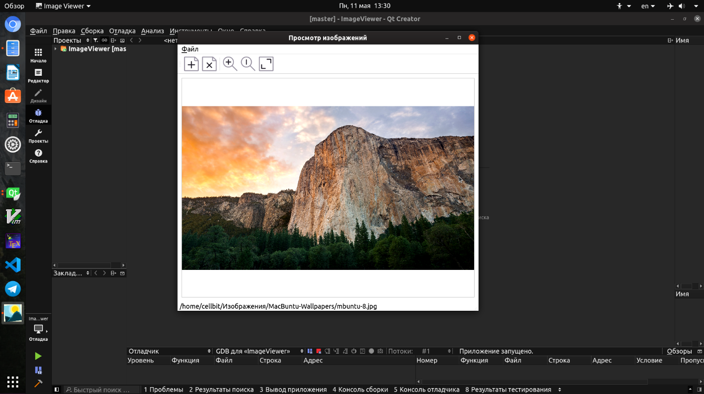
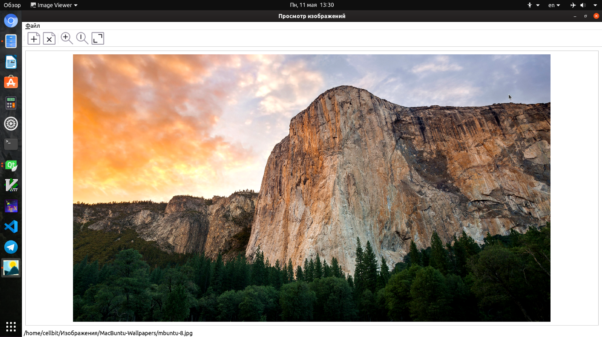
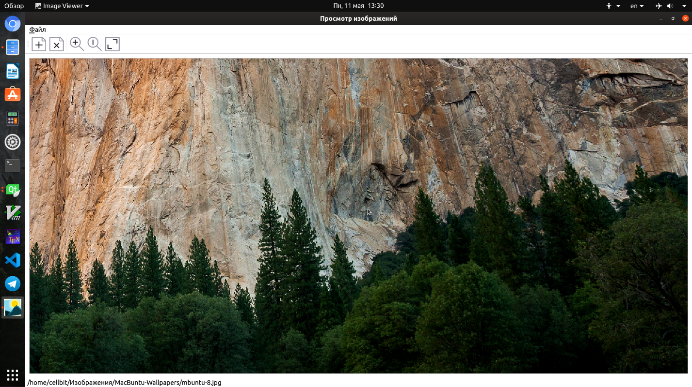
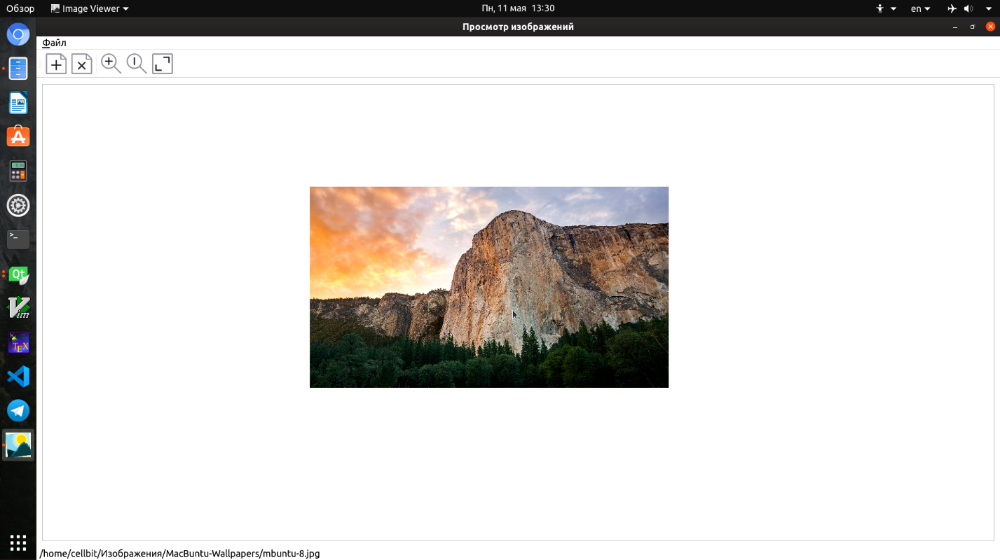
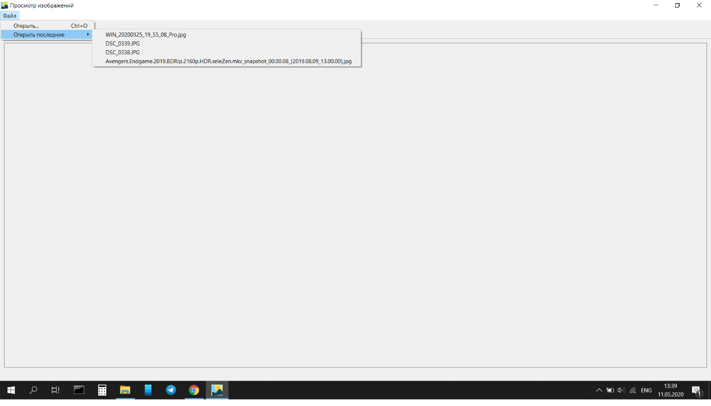

# Приложение для просмотра графического материала

Реализация приложения для просмотра графического материала на с++ с помощью фреймворка Qt. Приложение осуществляет: поиск файлов с разрешениями jpeg, bmp, png, сохранение последних открытых ссылок на них в файл, для быстрого доступа при повторном запуске приложения. Так же доступно мастшабирование и прокрутка изображений. 

# Скриншоты работы приложения

